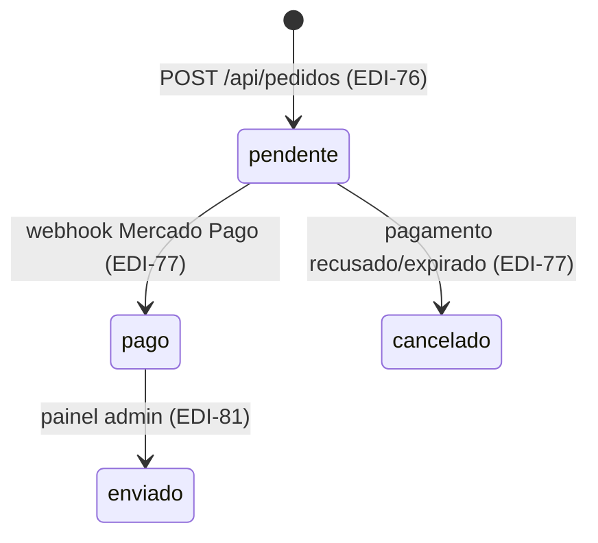

# Data Model: Carrinho e Checkout (EDI-76)

Modelagem derivada da spec (`specs/003-carrinho-checkout/spec.md`) e do modelo existente da Tarefa 1.

## 1. Carrinho (estado no cliente, não persistido no banco)

Representa a intenção de compra do visitante. Vive no navegador (`localStorage`), sem tabela no MongoDB.

| Campo | Tipo | Regras |
|---|---|---|
| `itens` | `ItemCarrinho[]` | Lista de itens; um item por produto |
| `versao` | `number` | Opcional — para evolução futura do schema persistido |

`ItemCarrinho`:

| Campo | Tipo | Regras |
|---|---|---|
| `produtoId` | `string` | ID do produto no catálogo |
| `quantidade` | `number` | Inteiro ≥ 1; adição respeita o estoque vigente (FR-005) |

Derivados (calculados, nunca persistidos): `subtotal = precoUnitario × quantidade`; `total = Σ subtotais`. Os preços exibidos no carrinho são informativos — o valor do pedido é sempre recalculado no servidor.

**Regras de mutação**: adicionar produto existente soma quantidades (limitado ao estoque); alterar quantidade valida ≥ 1 e ≤ estoque informado no momento; remover item elimina a linha; limpar esvazia após criação do pedido (FR-012).

## 2. Pedido (coleção `pedidos` — modelo existente da Tarefa 1, estendido)

Campos já existentes (ver `lib/models/pedido.ts`): `itens`, `cliente`, `status`, `canalOrigem`, `valorTotal`, `pagamento`, `criadoEm`, `atualizadoEm`.

**Campo novo nesta tarefa:**

| Campo | Tipo | Regras |
|---|---|---|
| `idempotencia` | `string` (opcional) | Token gerado pelo cliente ao abrir o checkout; **índice único esparso** — garante que um mesmo envio nunca gere dois pedidos (FR-013) |

Regras de criação:

- `status` = `"pendente"` (único status criado nesta tarefa; transições ficam para EDI-77/EDI-81).
- `canalOrigem` = `"site"`.
- `itens[].precoUnitario` e `valorTotal` calculados exclusivamente no servidor, com preços lidos do banco no momento da confirmação (FR-010, SC-003). O cliente nunca envia preço.
- `cliente.endereco` obrigatório completo (logradouro, número, bairro, cidade, estado, cep); `complemento` e `telefone` opcionais.
- `pagamento` vazio nesta tarefa (método/status/referência são preenchidos em EDI-77).

## 3. Validação de estoque (sem alteração de dados)

No momento do POST de pedido, para cada `produtoId` único da requisição:

1. Produto DEVE existir na coleção `produtos` (produto removido → checkout bloqueado).
2. `Σ quantidades ≤ produto.estoque` (itens duplicados somam — Edge Case do spec).
3. `estoque` nunca é alterado nesta tarefa (FR-015; abatimento é EDI-78).

Falha em qualquer regra → resposta de erro com item e quantidade disponível (FR-009, SC-002).

## 4. Transições de estado

Nesta tarefa apenas a transição `[*] → pendente` é implementada.

## 5. Índices MongoDB

| Coleção | Índice | Tipo | Motivo |
|---|---|---|---|
| `pedidos` | `{ idempotencia: 1 }` | único, esparso | Anti-duplicação de checkout (FR-013) |
| `pedidos` | `{ criadoEm: -1 }` | simples | Listagem futura do painel admin (EDI-81); barato agora |

Índices existentes de `produtos` (Tarefa 2) permanecem inalterados.
