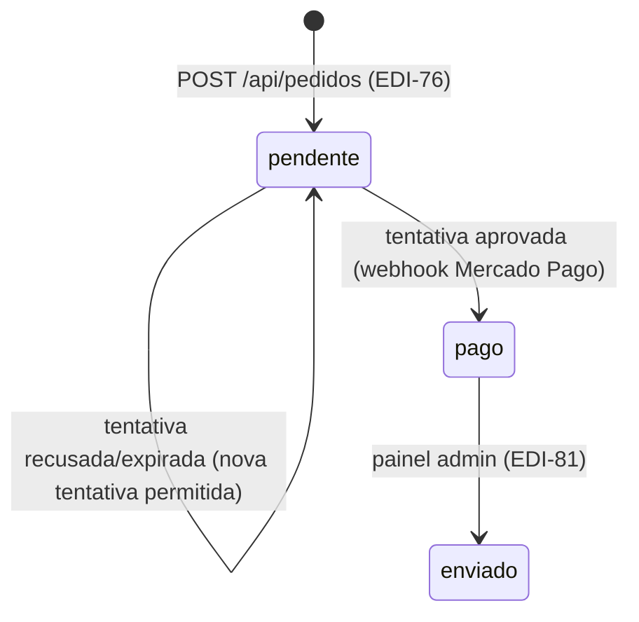

# Data Model: Integração de Pagamento — Mercado Pago (EDI-77)

Modelagem derivada da spec (`specs/004-pagamento-mercado-pago/spec.md`) e do modelo existente das Tarefas 1 e 3.

## 1. Pedido (coleção `pedidos` — estende o modelo existente)

Campos já existentes permanecem (`itens`, `cliente`, `status`, `canalOrigem`, `valorTotal`, `idempotencia`, `criadoEm`, `atualizadoEm`). O campo `pagamento` (antes um placeholder) ganha estrutura nesta tarefa:

| Campo | Tipo | Regras |
|---|---|---|
| `pagamento.metodo` | `string` (opcional) | Método da tentativa aprovada ou mais recente (`"credit_card"` \| `"pix"`) |
| `pagamento.status` | `StatusTentativaPagamento` (opcional) | Espelha o status da tentativa mais recente/relevante, para leitura rápida sem varrer `tentativas` |
| `pagamento.referenciaExterna` | `string` (opcional) | ID do pagamento no Mercado Pago da tentativa aprovada (ou mais recente) |
| `pagamento.tentativas` | `TentativaPagamento[]` | Histórico de todas as tentativas de pagamento deste pedido (FR-006/FR-007/FR-008) |

`TentativaPagamento` (novo tipo):

| Campo | Tipo | Regras |
|---|---|---|
| `referenciaExterna` | `string` | ID do pagamento no Mercado Pago — chave usada para casar com o webhook |
| `metodo` | `string` | `payment_method_id` retornado pelo MP (ex: `"visa"`, `"pix"`) |
| `status` | `StatusTentativaPagamento` | `"pendente"` \| `"aprovado"` \| `"recusado"` \| `"expirado"` — mapeado do `status` do MP (`pending`/`in_process` → `"pendente"`; `approved` → `"aprovado"`; `rejected` → `"recusado"`; `cancelled` → `"expirado"`) |
| `valor` | `number` | Valor em centavos no momento da tentativa — DEVE bater com `pedido.valorTotal` (FR-004) |
| `criadoEm` | `Date` | Quando a tentativa foi criada no nosso backend |
| `atualizadoEm` | `Date` | Última atualização (ex: quando o webhook confirma) |

### Regras de transição do pedido

- `pendente → pago`: quando alguma tentativa é confirmada `"aprovado"` pelo webhook (FR-003). Transição **condicional** — só ocorre se o pedido ainda não estiver `"pago"` (idempotência, FR-005).
- `pendente → pendente`: tentativa recusada ou expirada NÃO altera o status do pedido — apenas a tentativa correspondente é marcada `"recusado"`/`"expirado"`, permitindo nova tentativa (FR-006, FR-008). **Correção**: o `data-model.md` da Tarefa 3 especulou uma transição `pendente → cancelado` para este caso; esta tarefa a substitui pela regra acima (ver `research.md` #4).
- `pago → *`: nenhuma nova tentativa de pagamento é aceita sobre um pedido já `"pago"` (FR-009).
- Nenhuma transição desta tarefa altera estoque (FR-010).

## 2. Regra de uma tentativa ativa por vez

Antes de criar uma nova tentativa (`POST /api/pagamentos`):

1. Pedido DEVE existir e estar `"pendente"` (senão: `409`, já pago).
2. Não pode haver tentativa em `pagamento.tentativas` com `status: "pendente"` criada há menos de alguns minutos (janela curta, evita corrida entre abas) — se houver, `409`.
3. `valor` da nova tentativa é sempre `pedido.valorTotal` lido do banco — nunca aceito do cliente (FR-004).

## 3. Atualização via webhook (idempotente)

Ao processar uma notificação válida do Mercado Pago:

1. Buscar detalhes do pagamento na API do MP pelo `id` recebido (nunca confiar em dados do payload em si).
2. Localizar o pedido por `pagamento.external_reference`.
3. Atualizar a tentativa cujo `referenciaExterna` bate com o `id` do pagamento (por posição no array); se a tentativa ainda não existir localmente (corrida rara), inserir uma nova a partir dos dados do MP.
4. Se o novo status da tentativa é `"aprovado"` **e** o pedido ainda não está `"pago"`, atualizar `pedido.status = "pago"` e `pedido.pagamento.{metodo,status,referenciaExterna}` nesta mesma operação condicional.
5. Reprocessar a mesma notificação depois não gera efeito adicional (idempotência, FR-005, SC-003).

## 4. Índices MongoDB

Nenhum índice novo necessário nesta tarefa — a busca do pedido pelo webhook usa `external_reference` (o próprio `_id` do pedido, convertido de/para `ObjectId`), já indexado nativamente pelo MongoDB como chave primária. Os índices de `pedidos` criados na Tarefa 3 (`idempotencia`, `criadoEm`) permanecem inalterados.
