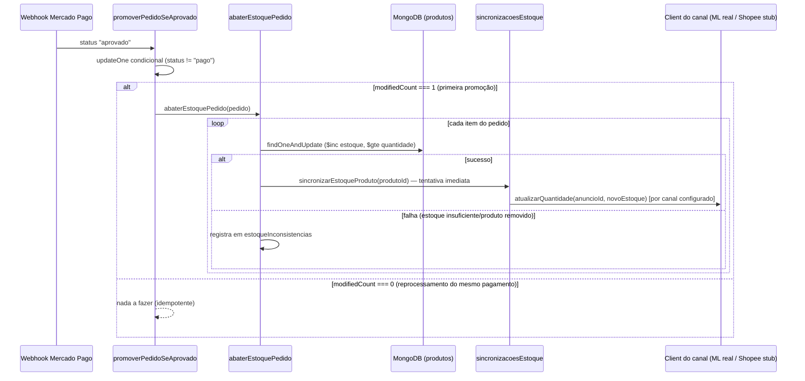

# Data Model: Abatimento de Estoque e Sincronização Multicanal (EDI-78)

Modelagem derivada da spec (`specs/005-estoque-sincronizacao-canais/spec.md`) e do modelo existente das Tarefas 1, 2 e 4.

## 1. Produto (coleção `produtos` — estende o modelo existente)

Campos já existentes permanecem (`nome`, `slug`, `descricao`, `preco`, `fotos`, `estoque`, `categoria`, `criadoEm`, `atualizadoEm`). Novo campo opcional:

| Campo | Tipo | Obrigatório | Regras |
|---|---|---|---|
| `integracoes.mercadoLivreId` | `string` | não | ID do anúncio (`item_id`) correspondente no Mercado Livre; ausente = produto sem anúncio nesse canal |
| `integracoes.shopeeItemId` | `string` | não | ID do anúncio correspondente na Shopee; ausente = produto sem anúncio nesse canal |

`estoque` continua sendo abatido apenas por operação atômica condicional (`$inc` com `$gte`, ver `research.md` #2) — nunca por leitura + escrita separadas.

## 2. Registro de Sincronização de Estoque (nova coleção `sincronizacoesEstoque`)

| Campo | Tipo | Obrigatório | Regras |
|---|---|---|---|
| `_id` | `ObjectId` | gerado | — |
| `produtoId` | `ObjectId` | sim | referência ao produto afetado |
| `pedidoId` | `ObjectId` | sim | pedido que originou o abatimento (rastreabilidade) |
| `canal` | `"mercado_livre" \| "shopee"` | sim | canal de destino desta sincronização |
| `quantidade` | `number` | sim | novo valor de `estoque` a ser refletido no canal (não um delta) |
| `status` | `"pendente" \| "sincronizado" \| "falhou"` | sim | estado atual do item na fila |
| `tentativas` | `number` | sim | contador de tentativas já realizadas |
| `proximaTentativaEm` | `Date` | sim | quando o reprocessamento (`POST /api/estoque/sincronizar`) pode tentar de novo |
| `ultimoErro` | `string` | não | mensagem/motivo da última falha, para consulta manual |
| `criadoEm` | `Date` | gerado | — |
| `atualizadoEm` | `Date` | gerado | atualizado a cada tentativa |

### Estados e transições

- **Criação**: um item é criado com `status: "pendente"` sempre que `sincronizarEstoqueProduto` identifica um canal configurado (credencial + `produto.integracoes.<canal>` presentes) para o produto abatido.
- **`pendente → sincronizado`**: chamada ao client do canal responde com sucesso.
- **`pendente → pendente` (retry)**: chamada falha e `tentativas < máximo`; `tentativas++`, `proximaTentativaEm` recalculada com backoff (`research.md` #4).
- **`pendente → falhou`**: chamada falha e `tentativas` já atingiu o máximo; fica visível em `GET /api/estoque/pendencias` para revisão manual.
- Um canal sem credencial/mapeamento configurado **nunca** gera um item aqui (FR-007) — não é um estado "ignorado", é ausência de registro.

## 3. Inconsistências de Estoque (nova coleção `estoqueInconsistencias`)

Cobre o edge case em que o abatimento atômico falha (estoque insuficiente no instante da venda, ou produto removido) — situação em que o pagamento já foi aprovado e não pode ser desfeito automaticamente (FR-004).

| Campo | Tipo | Obrigatório | Regras |
|---|---|---|---|
| `_id` | `ObjectId` | gerado | — |
| `produtoId` | `ObjectId` | sim | produto afetado (pode não existir mais no catálogo) |
| `pedidoId` | `ObjectId` | sim | pedido cujo item não pôde ser abatido corretamente |
| `quantidadeSolicitada` | `number` | sim | quantidade que o pedido exigia abater |
| `motivo` | `"estoque_insuficiente" \| "produto_removido"` | sim | causa identificada |
| `criadoEm` | `Date` | gerado | — |
| `resolvidoEm` | `Date` | não | preenchido quando o responsável da loja marcar como tratado manualmente |

## 4. Credenciais de Canal (nova coleção `credenciaisCanais`)

Necessária apenas para o Mercado Livre nesta tarefa (OAuth2 com `refresh_token` rotativo — `research.md` #7); a Shopee, como stub, não grava nada aqui ainda.

| Campo | Tipo | Obrigatório | Regras |
|---|---|---|---|
| `_id` | `"mercado_livre"` | sim | um único documento por canal (chave fixa, não `ObjectId`) |
| `accessToken` | `string` | sim | token vigente |
| `refreshToken` | `string` | sim | token de renovação vigente (substituído a cada uso) |
| `expiraEm` | `Date` | sim | validade do `accessToken` |
| `atualizadoEm` | `Date` | gerado | última renovação |

## 5. Fluxo ponta a ponta (visão geral)

## 6. Índices MongoDB

- `sincronizacoesEstoque`: índice em `{ status: 1, proximaTentativaEm: 1 }` — acelera a varredura do reprocessamento (`POST /api/estoque/sincronizar`), que busca `status: "pendente"` com `proximaTentativaEm <= agora`.
- `sincronizacoesEstoque`: índice em `{ produtoId: 1 }` — acelera consulta de pendências por produto.
- `estoqueInconsistencias`: índice em `{ resolvidoEm: 1 }` (esparso) — acelera listar apenas as não resolvidas.
- `credenciaisCanais`: coleção de 1 documento por canal, sem índice adicional necessário.
