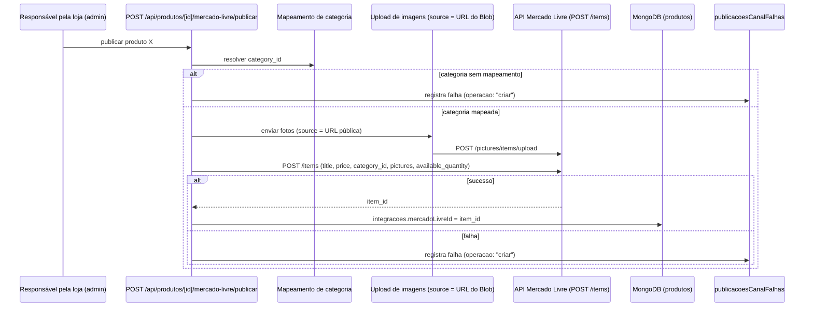
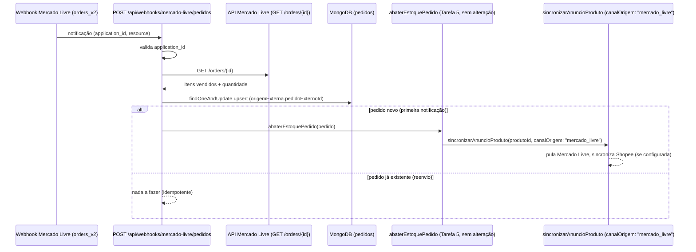

# Data Model: Integração com Mercado Livre — Anúncios e Vendas (EDI-80)

Modelagem derivada da spec (`specs/006-integracao-mercado-livre/spec.md`) e do modelo existente das Tarefas 1-5. Campos e coleções já existentes que não mudam de forma não são repetidos aqui — ver `specs/005-estoque-sincronizacao-canais/data-model.md`.

## 1. Produto (coleção `produtos` — sem mudança de schema)

`integracoes.mercadoLivreId` (Tarefa 5) passa a poder ser preenchido automaticamente pela criação de anúncio desta tarefa, além do preenchimento manual já existente — o campo e seu significado ("ausência = produto sem anúncio nesse canal") não mudam.

## 2. Pedido (coleção `pedidos` — estende o modelo existente)

| Campo | Tipo | Obrigatório | Regras |
|---|---|---|---|
| `origemExterna.canal` | `"mercado_livre" \| "shopee"` | não | presente apenas em pedidos originados fora do site |
| `origemExterna.pedidoExternoId` | `string` | não | ID do pedido/venda no canal externo — chave de idempotência do webhook (research.md #2) |

Um pedido com `origemExterna` preenchido é criado já com `status: "pago"` e `canalOrigem` igual ao canal de `origemExterna.canal` — o Mercado Livre só notifica vendas com pagamento aprovado, não há estados intermediários a acompanhar como no checkout do site.

`itens[].produtoId` é resolvido a partir do `item_id` do Mercado Livre via `produto.integracoes.mercadoLivreId` (busca reversa); um item do pedido do Mercado Livre sem produto correspondente no catálogo do site não gera `ItemPedido` — vira uma inconsistência (ver `estoqueInconsistencias`, Tarefa 5, motivo `produto_removido`) sem impedir os demais itens do mesmo pedido.

## 3. Falha de Publicação/Atualização de Anúncio (nova coleção `publicacoesCanalFalhas`)

Cobre FR-011 — falhas ao criar ou atualizar um anúncio em si (dados do anúncio), distinto de falhas ao sincronizar apenas a quantidade/preço já cobertas por `sincronizacoesEstoque` (Tarefa 5, ver research.md #9).

| Campo | Tipo | Obrigatório | Regras |
|---|---|---|---|
| `_id` | `ObjectId` | gerado | — |
| `produtoId` | `ObjectId` | sim | produto cuja publicação/atualização falhou |
| `canal` | `"mercado_livre" \| "shopee"` | sim | canal de destino |
| `operacao` | `"criar" \| "atualizar"` | sim | qual ação falhou |
| `motivo` | `string` | sim | mensagem/causa identificada (ex: "categoria sem mapeamento", "foto rejeitada", "credencial inválida") |
| `criadoEm` | `Date` | gerado | — |
| `resolvidoEm` | `Date` | não | preenchido quando o responsável pela loja marcar como tratado manualmente |

Não tem fila de retry automático (ao contrário de `sincronizacoesEstoque`) — a maioria dos motivos (categoria sem mapeamento, dado obrigatório ausente) exige correção manual do cadastro antes de qualquer nova tentativa fazer sentido.

## 3.1. Ajustes pós-implementação em modelos da Tarefa 5

Descobertos necessários durante a implementação, não previstos na modelagem inicial acima:

- **`InconsistenciaEstoque`** (`sincronizacoesEstoque`, Tarefa 5): `produtoId` e `pedidoId` passaram de obrigatórios para opcionais. Um item de pedido do Mercado Livre sem produto correspondente no catálogo (FR-012) não tem `produtoId`/`pedidoId` locais para referenciar — nesse caso o registro carrega `origemExterna: { canal, pedidoExternoId, itemIdCanal }` no lugar. `GET /api/estoque/pendencias` foi ajustada para expor os dois formatos.
- **`RegistroSincronizacaoEstoque`** (`sincronizacoesEstoque`, Tarefa 5): `pedidoId` passou de obrigatório para opcional. A sincronização de preço/estoque disparada por uma edição de produto no admin (User Story 3, `PATCH /api/produtos/[id]`) não nasce de nenhum pedido — não há `pedidoId` para registrar rastreabilidade nesse caso.

## 4. Índices MongoDB (novos/alterados)

- `pedidos`: índice único esparso em `{ "origemExterna.pedidoExternoId": 1 }` — garante que o reenvio da mesma notificação do Mercado Livre nunca crie um segundo pedido (FR-008), no mesmo padrão já usado para `idempotencia` (Tarefa 3).
- `publicacoesCanalFalhas`: índice em `{ resolvidoEm: 1 }` (esparso) — acelera listar apenas falhas ainda não resolvidas (`GET /api/anuncios/pendencias`).
- `publicacoesCanalFalhas`: índice em `{ produtoId: 1 }` — acelera consulta de falhas por produto.

## 5. Fluxo ponta a ponta: publicar produto como anúncio

## 6. Fluxo ponta a ponta: venda no Mercado Livre abate estoque

