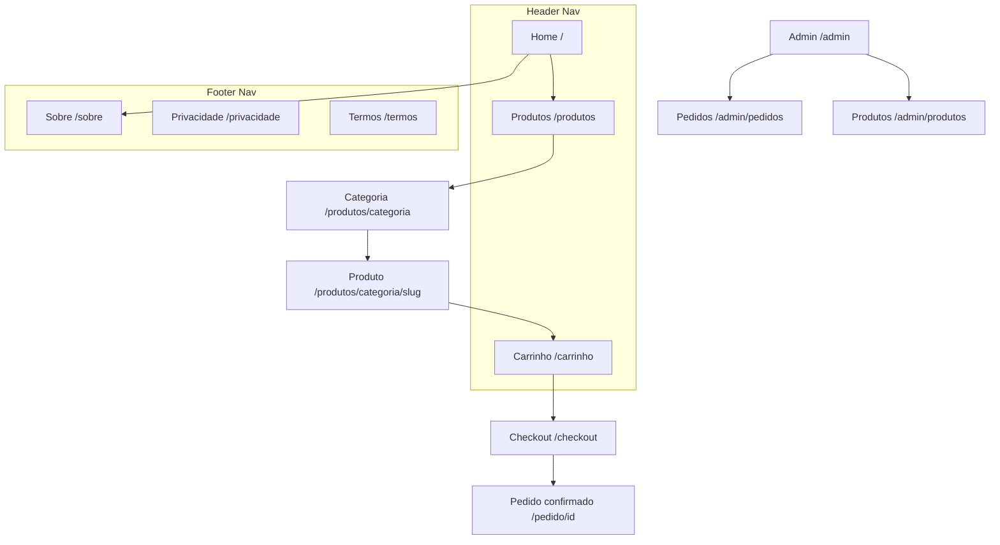

# Arquitetura do Site — Voxelas Duo (E-commerce de Produtos 3D)

**Épico**: EDI-73 | **Status**: Referência de planejamento, cross-feature
**Escopo**: Hierarquia de páginas, navegação, URLs e linkagem interna do site público e da área administrativa. Alimenta principalmente as Tarefas 2 (EDI-75 — Catálogo), 3 (EDI-76 — Carrinho/Checkout) e 8 (EDI-81 — Painel administrativo); não faz parte da Tarefa 1 (EDI-74 — infraestrutura), que já cria o esqueleto de rotas de API correspondente (`/api/produtos`, `/api/pedidos`, `/api/webhooks`).

## Suposições

- Páginas de categoria usam URL própria (`/produtos/[categoria]`) em vez de apenas query param, para indexação/SEO.
- `/sobre` é uma página opcional de storytelling da marca — não estava explicitamente no épico, é sugestão de acordo com o público-alvo (adolescentes e famílias, EDI-83).
- Catálogo é pequeno (projeto pessoal/familiar), então a navegação é deliberadamente enxuta — sem mega menu ou múltiplos níveis de dropdown.

## 1. Hierarquia de páginas

```
Home (/)
├── Produtos (/produtos)
│   ├── Categoria (/produtos/[categoria])
│   └── Produto (/produtos/[categoria]/[slug])
├── Carrinho (/carrinho)
├── Checkout (/checkout)
├── Pedido confirmado (/pedido/[id])
├── Sobre (/sobre)                      ← opcional, sugerido
├── Admin (protegido por login)
│   ├── /admin/produtos
│   ├── /admin/produtos/novo
│   ├── /admin/produtos/[id]/editar
│   └── /admin/pedidos                  (EDI-81: pedidos de todos os canais)
└── Legal
    ├── /privacidade
    └── /termos
```

## 2. Sitemap visual



## 3. Mapa de URLs

| Página | URL | Pai | Onde aparece | Prioridade | Tarefa relacionada |
|---|---|---|---|---|---|
| Home | `/` | — | Header (logo) | Alta | — |
| Produtos | `/produtos` | Home | Header | Alta | EDI-75 |
| Categoria | `/produtos/[categoria]` | Produtos | Filtro/link contextual | Média | EDI-75 |
| Produto | `/produtos/[categoria]/[slug]` | Categoria | Card de produto | Alta | EDI-75 |
| Carrinho | `/carrinho` | — | Ícone fixo no header | Alta | EDI-76 |
| Checkout | `/checkout` | Carrinho | Botão "Finalizar compra" | Alta | EDI-76 |
| Pedido confirmado | `/pedido/[id]` | Checkout | Redirect pós-pagamento | Média | EDI-77 |
| Sobre | `/sobre` | Home | Footer (+ header, opcional) | Baixa | não mapeado no épico |
| Admin – Produtos | `/admin/produtos` | Admin | Menu interno (não público) | — | EDI-75, EDI-81 |
| Admin – Pedidos | `/admin/pedidos` | Admin | Menu interno (não público) | — | EDI-81 |
| Privacidade / Termos | `/privacidade`, `/termos` | — | Footer | Baixa | não mapeado no épico |

## 4. Navegação

- **Header**: Logo (→ Home) · Produtos · Carrinho (ícone com contador) — sem itens a mais; catálogo pequeno não justifica dropdown/mega menu.
- **Footer**: Sobre · Privacidade · Termos · (contato, se decidir ter um).
- **Breadcrumb** em produto: `Home > Produtos > [Categoria] > [Nome do produto]`.
- **Admin**: navegação própria, separada do site público, atrás de autenticação (mecanismo de auth a definir em EDI-81).

## 5. Linkagem interna

- Toda página de produto linka de volta para sua categoria e para "Produtos" (breadcrumb).
- Home destaca produtos/categorias em destaque, linkando direto para `/produtos/[categoria]/[slug]`.
- Nenhuma página órfã: cada categoria só existe (e aparece em navegação) se houver ao menos 1 produto nela — evita `/produtos/[categoria]` vazio.
